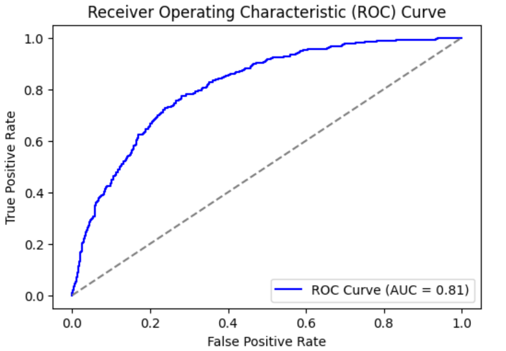
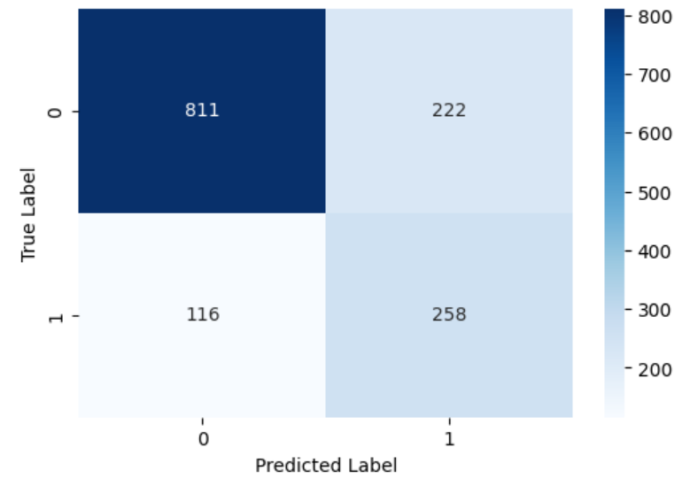

# 📉 Telecom Churn Prediction

Predicting customer churn in the telecom industry using machine learning techniques to help businesses improve customer retention.


---

## 🔍 Overview

Customer churn (attrition) is a major concern for telecom companies. This project builds a predictive model to identify customers likely to leave based on their service usage patterns, demographics, and account information.

The goal is to enable companies to take proactive retention steps using data-driven insights.

---

## 📁 Project Structure

```
├── data/                     # Datasets
├── notebooks/                # Jupyter notebooks with EDA, training, and evaluation
├── models/                   # Trained models and weights
├── visuals/                  # ROC curves, confusion matrix, and plots
├── report/                   # Final report summarizing methodology and findings
└── README.md
```

---

## 🧠 Techniques Used

- **Languages & Tools**: Python, Pandas, NumPy, Scikit-Learn, TensorFlow/Keras, Matplotlib, Seaborn
- **Data Preprocessing**:
  - Missing value handling (`TotalCharges`)
  - One-Hot Encoding for categorical variables
  - SMOTE for class imbalance correction
  - Train-Test Split (80-20)
- **Model Architecture**: Feedforward Neural Network (Multilayer Perceptron)
  - Input → Dense(64, ReLU) → Dropout(0.3) → Dense(32, ReLU) → Dropout(0.3) → Output(Sigmoid)
- **Evaluation Metrics**:
  - Accuracy: **80.4%**
  - AUC Score: **0.842**
  - Precision, Recall, F1-Score, Confusion Matrix, ROC Curve

---

## 📊 Results Summary

| Metric        | Churned (Class 1) | Not Churned (Class 0) |
|---------------|-------------------|------------------------|
| Precision     | 0.60              | 0.89                   |
| Recall        | 0.61              | 0.89                   |
| F1-score      | 0.60              | 0.89                   |
| AUC           | 0.842             | —                      |
| Accuracy      | 80.4%             | —                      |

<p align="left">
  
  <br>
  <i>Figure: ROC Curve</i>
</p>

<p align="left">
  
  <br>
  <i>Figure: Confusion Matrix</i>
</p>

---

## 🚀 Getting Started

### 1. Clone the repository

```bash
git clone https://github.com/TryMk/Telecom-Churn-Prediction.git
cd Telecom-Churn-Prediction
```

### 2. Install dependencies

```bash
pip install -r requirements.txt
```

### 3. Run model training

```bash
python churn_model.py
```

Or use Jupyter notebooks in the `notebooks/` directory for interactive exploration.

---

## 📌 Dataset

- Source: [IBM Sample Datasets](https://www.ibm.com/communities/analytics/watson-analytics-blog/guide-to-sample-datasets/)
- ~7,000 customers
- Features include:
  - Demographics: Gender, Senior Citizen, Partner, Dependents
  - Services: Internet, Phone, Security, Streaming
  - Account Info: Contract, Charges, Tenure
  - Target: Churn (Yes/No)

---

## 🛠️ Future Improvements

- Hyperparameter tuning using GridSearchCV
- Ensemble methods: XGBoost, Random Forest
- Explainability with SHAP or LIME
- Deployment via Flask/Streamlit for real-time use
- Integration with customer management systems (CRM)

---

## 📄 Report

📎 [Internship Report (PDF)](https://github.com/TryMk/Telecom-Churn-Prediction/blob/main/Telecom_Churn_Prediction.pdf)

---

## 🤝 Contributing

Contributions, suggestions, and issues are welcome!

1. Fork the repository
2. Create a new branch (`git checkout -b feature-name`)
3. Commit your changes
4. Push and open a pull request

---

## 📜 License

This project is licensed under the [MIT License](LICENSE).
